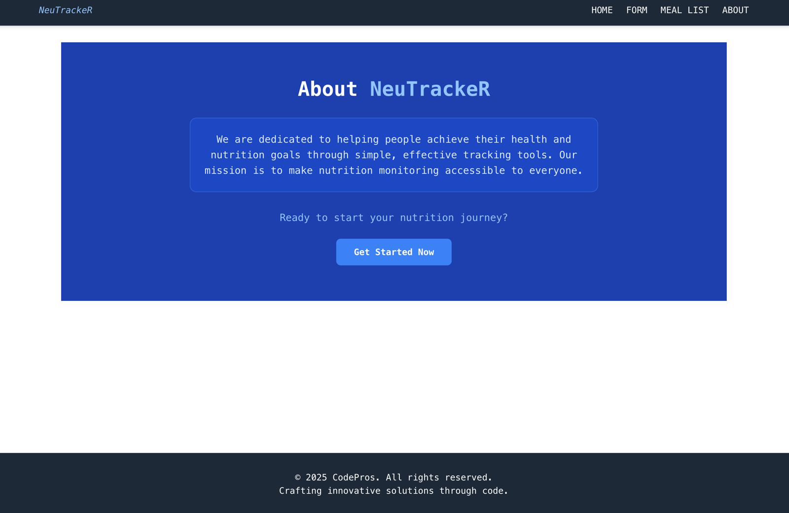
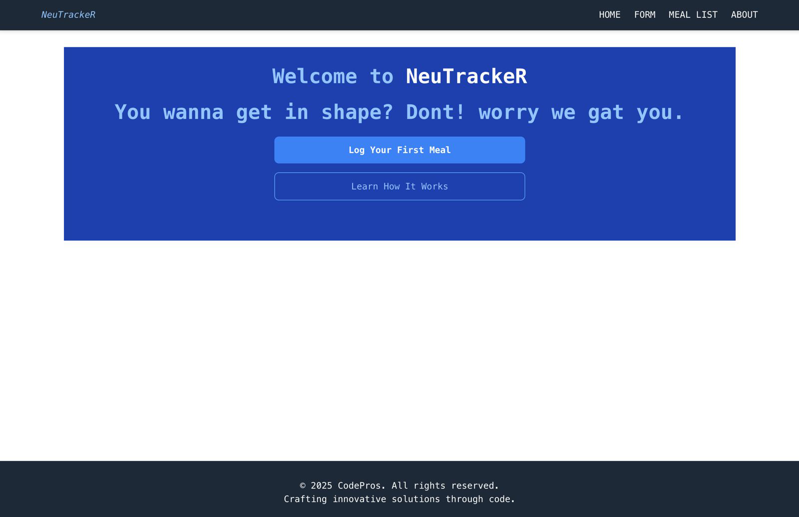
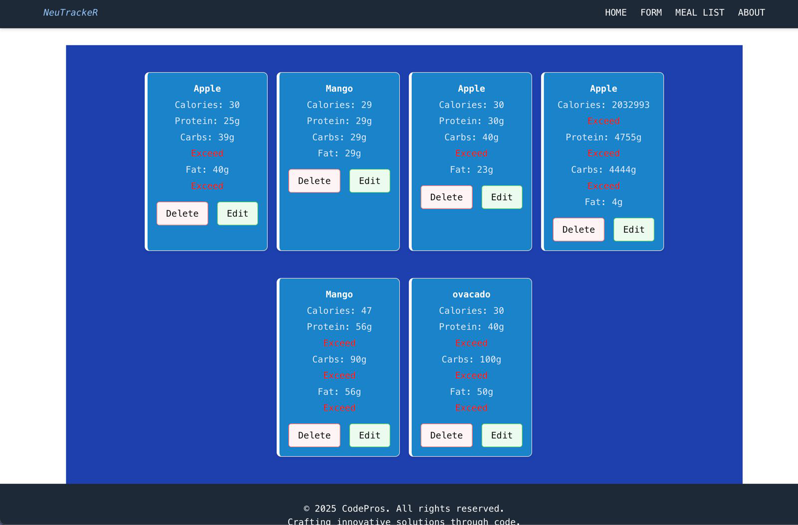
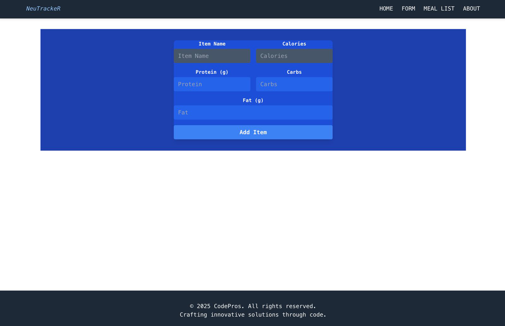

Nutrition Tracker App

A simple React-based nutrition tracker that allows users to log meals and track their calories, protein, carbs, and fat intake.

Deployed JSON Server API:  

     https://nutrition-api-nyjf.onrender.com/nutritions

Features

- Add meals with nutritional info (calories, protein, carbs, fat)
- View list of all added meals
- Basic routing using React Router
- JSON Server used as a mock API
- Deployed backend on Render

 Tech Stack

- Frontend: React (with Hooks), React Router
- Backend/API: JSON Server
- Deployment: Render (for the API)

Project Structure

src/
├── components/
│   ├── Card.css
│   ├── MealItem.js
│   └── MealList.js
│
├── pages/
│   ├── About.js
│   ├── Home.js
│   ├── Layout.js
│   └── MealForm.js
│
├── App.css
├── App.js
├── index.js
├── index.css
├── package-lock.json
├── package.json
├── README.md

Getting Started

1. Clone the repository
   

bash

          git clone https://github.com/daganeabdul/nutrition-api.git
          cd nutrition-api

2. Install dependencies
   
        npm install

4. Run locally with JSON Server

   
If you want to run it locally:

    npx json-server db.json --port 3000
    
    npm start

Or, update your package.json like this:

"scripts": {
  "start": "json-server db.json --port 3000"
}

Then run:

    npm start

4. App Entry Point

       Visit http://localhost:3000 after starting the dev server.

API Endpoint
GET /nutritions         // Get all meals
POST /nutritions        // Add a new meal

Example of a meal object:

{
  "itemName": "Chicken Breast",
  "calories": "165",
  "protein": "31",
  "carbs": "0",
  "fat": "3.6"
}

 Screenshots

 Contribution
Contributions are welcome!

 Fork the repo, make your changes, and submit a PR.

📝 License
MIT License

 Author’s
Abdulrahman Dagane
Nate  
Oliver  Ekeno

